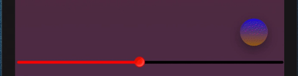

# React Native Strobe

Customizable strobe for react native.




### Prerequisites

If you want to use this library, you also need to install:

```
react-native-linear-gradient
```

## Installing

Using npm:

```
npm install react-native-strobe
```

Using yarn:

```
yarn add react-native-strobe
```

## Usage example

```
import { Strobe } from "react-native-strobe";

<Strobe
  songDuration={musicData.durationSec}
  waveform={currentSongWaveform}
  samplesInSec={wfSamplesPS}
  closeStrobe={() => turnStrobe(false)} 
  buttonPosition={'bottomCenter'}
  syncInterval={2000}
  {...{paused, progress}}
/>
```

## Props


```
liteMode: boolean;
```
render strobe as a small block


```
paused: boolean;
```
is the track paused at the moment

```
buttonPosition?: 'bottomCenter' | 'bottomRight';
```
Position of "close" button

```
defaultText?: string;
```
Placeholder

```
defaultColor1Index?: number;
```
Default index (in strobeColorsArray) of first strobe color

```
defaultColor2Index?: number;
```
Default index (in strobeColorsArray) of second strobe color

```
maxSampleValue?: number;
```
128 by default

```
strobeColorsArray?: string[];
```
Your's array of colors for strobe

```
syncInterval: number;
```
interval (in milliseconds) between updates of the progress prop

```
useGradient?: boolean;
```
Use gradient  feautures

```
progress: number;
```
(In seconds) - current playing time

```
songDuration: number;
```
(In seconds) - track duration

```
waveform?: Waveform;

type Waveform = {
  bits: number;
  channels: number;
  data: number[];
  length: number;
  sample_rate: number;
  samples_per_pixel: number;
}
```

```
samplesInSec: number;

Use this formula to calculate samplesInSec number:
samplesInSec = Math.round(waveform.length * 2 / durationSec)
waveform - samples array
durationSec - duration of the track
```

```
updatesInSecond?: number;
```
5 by default

```
showCloseButton?: boolean;
```
default is true

```
closeStrobe: () => void;
```
callback when close button is pressed

```
customLiteContainerStyle?: ViewStyle;
```
Override LiteContainerStyle

```
customContainerStyle?: ViewStyle;
```
Override ContainerStyle

```
customBlockStyle?: ViewStyle;
```
Override BlockStyle

```
customTextContainerStyle?: ViewStyle;
```
Override TextContainerStyle

```
customStrobeTextStyle?: ViewStyle;
```
Override StrobeTextStyle

## How to form wave data (Node js)
* [useful package](https://github.com/bbc/audiowaveform)

```javascript
const { exec } = require('child_process')
const path = require('path')
//project path + folder with name 'music'
const uploadPath = path.resolve(process.cwd() + '/' + 'music')

const getWaveform = async(filename) => {
    const fullFileName = uploadPath + '/' + filename
    return new Promise((resolve,reject) => {
        const outputFullFileName = fullFileName.replace(/\.mp3/ig, '.json')
        let commandLine = 'audiowaveform -i'
        commandLine += ' "' + fullFileName + '" '
        commandLine += '-o'
        commandLine += ' "' + outputFullFileName + '" '
        commandLine += '-z 2048 -b 8'
        exec(commandLine, (e, stdout, stderr) => {
            if(e) reject(e)
            resolve( require( outputFullFileName ) )       
        })
    })
}

//Put some.mp3 to folder 'music' in your project folder
getWaveform('some.mp3')
.catch(e => console.log(e))
//Output of this function is json waveform data, you can write his to db or use whatever you like
.then(data => console.log(data))
```

## Built With

* [react-native-linear-gradient](https://www.npmjs.com/package/react-native-linear-gradient)

## Authors

* **Me** - *Initial work* - [Profile](https://github.com/RNEvok)

## License

This project is licensed under the MIT License - see the [LICENSE.md](./LICENSE.md) file for details